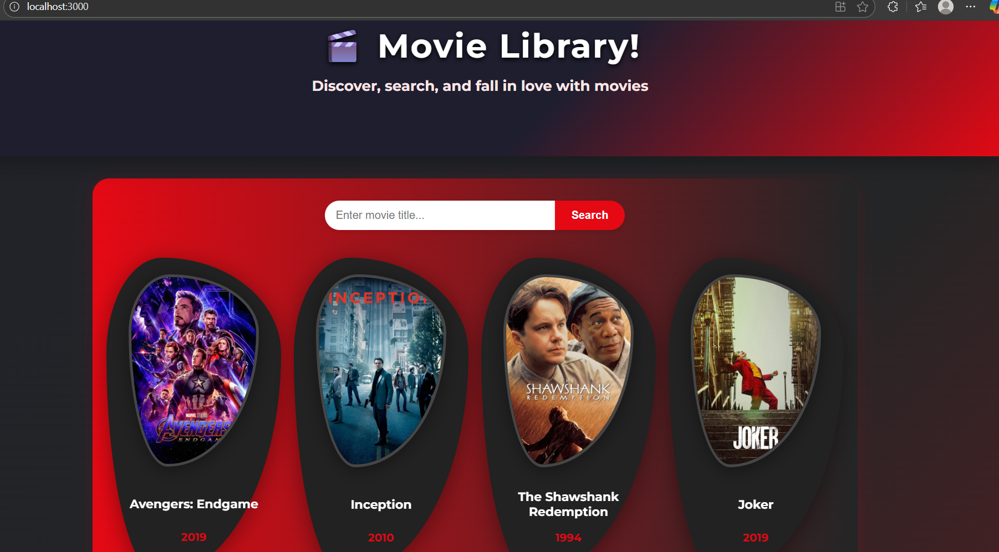
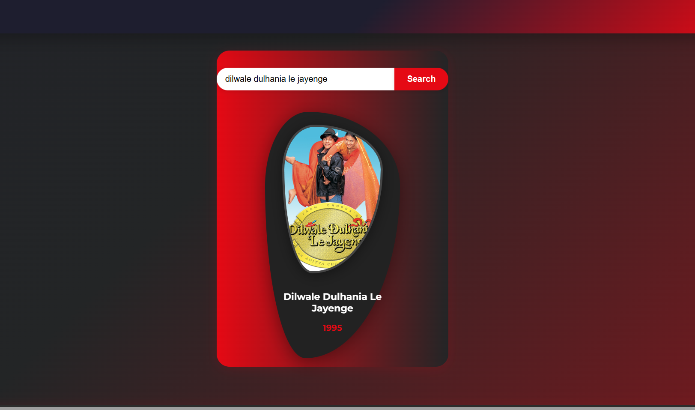

# Movie Card App

A modern React app showcasing a stylish card layout for movies with a unique organic border shape. Users can search movies by name and view their release years. Clicking a movie reveals full details in a modal popup.

---

## Features

- Responsive, animated gradient background
- Search bar filtering movie list dynamically
- Unique drop-shaped movie cards with hover effects
- Two-line truncation with ellipsis for long titles
- Modal popup showing selected movie details
- Clean, modern UI with bright accent colors

---

## Technologies Used

- React (functional components, hooks)
- CSS3 (clip-path, animations)
- Git & GitHub for version control and deployment

---

### Requirements

- Node.js (v12+)
- npm

### Installation & Run Locally

The app will run on http://localhost:3000

---

## Screenshots

---

## Deployment

Check out the live demo deployed on Netlify: [Live Site](https://moviemaze123.netlify.app/)

---

## Author

Nilanshu Raj- [Your GitHub](https://github.com/nilanshu489)
